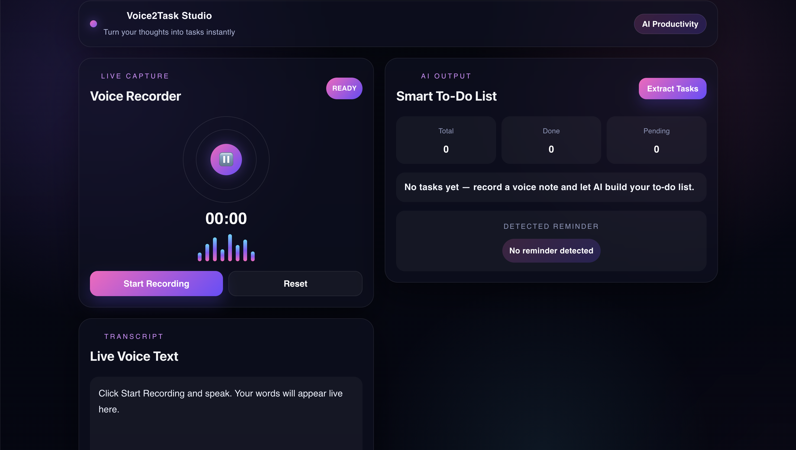
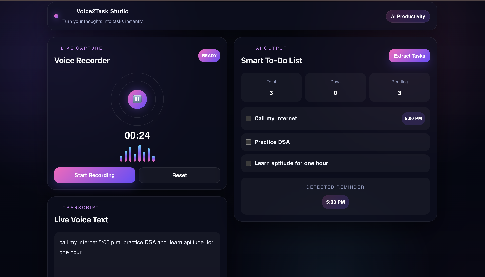
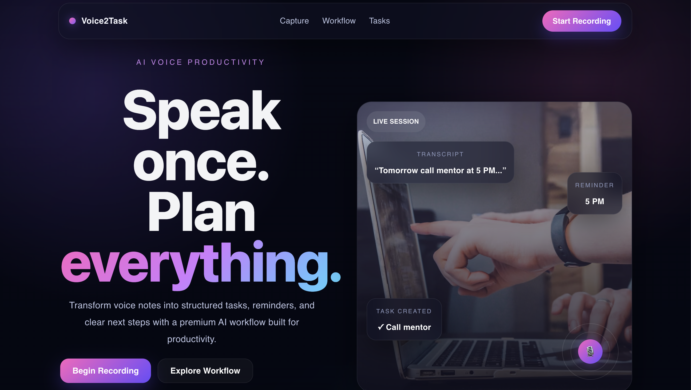

# Voice2Task 🎙️✨

Voice2Task is an AI-powered productivity web application that converts live voice notes into structured to-do tasks with real-time speech recognition, task extraction, and reminder detection.

It is designed to help users quickly capture spoken thoughts and transform them into an actionable task list through a clean and aesthetic interface.

---

## 🚀 Features

- 🎤 Real-time voice recording in the browser
- 📝 Live speech-to-text transcription
- ✅ Smart task extraction from spoken input
- ⏰ Time-based reminder detection
- 📋 Interactive to-do list with completion tracking
- 🎨 Modern dark-themed UI with premium aesthetic styling
- ⚡ Fast frontend-backend communication using React + FastAPI

---

## 📸 Screenshots

### 1. Landing / Main Screen


### 2. Live Recording in Progress


### 3. Extracted Tasks Output


---

## 🛠️ Tech Stack

### Frontend
- React.js
- CSS3
- Web Speech API / Browser Speech Recognition

### Backend
- FastAPI
- Python
- Regex-based task parsing logic
- Uvicorn

---

## ⚙️ Project Structure

```text
voice2task/
├── frontend/
├── backend/
├── screenshots/
│   ├── landing_page.png
│   ├── app_screen.png
│   └── final_page.png
├── README.md
└── .gitignore