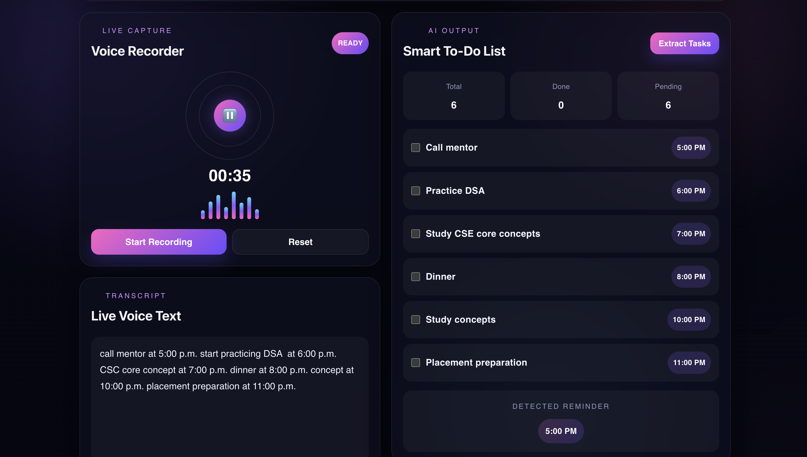

# Voice2Task

Voice2Task is an AI-powered productivity application that converts natural voice input into structured tasks and reminders.

The application allows users to record a voice note, convert speech into text, extract actionable tasks using the Google Gemini API, identify associated timings, and manage the resulting tasks through an interactive task management interface. User authentication and persistent task storage are handled through Supabase.

## Overview

Managing tasks from unstructured voice notes can be time-consuming. Voice2Task addresses this by transforming conversational input into actionable and time-aware tasks without requiring users to manually format or organize their thoughts.

For example:

> "Tomorrow at 5 PM, call my mentor, finish the project presentation and submit the report before evening."

Voice2Task processes the input, identifies the actionable items and associated time information, and converts them into structured tasks that can be tracked and completed.

## Key Features

- Voice-based task capture
- Real-time speech-to-text transcription
- AI-powered task extraction using Google Gemini
- Natural-language time detection
- Reminder detection
- Structured task and reminder generation
- Interactive task management
- Task completion tracking
- User authentication with Supabase
- Persistent PostgreSQL database storage
- User-specific task management
- Persistent task retrieval across navigation
- Responsive web interface
- Production deployment with Vercel

## Screenshots



## Application Flow

```text
Voice Input
    ↓
Speech-to-Text
    ↓
Transcript
    ↓
React Frontend
    ↓
FastAPI Backend
    ↓
Google Gemini API
    ↓
Task & Time Extraction
    ↓
Structured Task Data
    ↓
Supabase PostgreSQL
    ↓
Persistent Task Storage
    ↓
Task Management Interface

## Technology Stack

Frontend       → React.js, Vite, JavaScript, CSS3
Speech         → Web Speech API
Backend        → Python, FastAPI, Uvicorn
AI             → Google Gemini API
Database       → Supabase PostgreSQL
Authentication → Supabase Auth
Security       → Row Level Security
Deployment     → Vercel
Version Control → Git, GitHub

## Authentication & Security

User Authentication
        ↓
Authenticated User
        ↓
User ID
        ↓
User-Specific Tasks
        ↓
Supabase PostgreSQL

## Project Architecture

                    User
                     ↓
              Voice Input
                     ↓
             React Frontend
                     ↓
              FastAPI Backend
                     ↓
             Google Gemini
                     ↓
          Structured Task Data
                     ↓
                Supabase
             ↙             ↘
      Authentication      Database
                              ↓
                         Task Storage
                              ↓
                     Task Management UI
